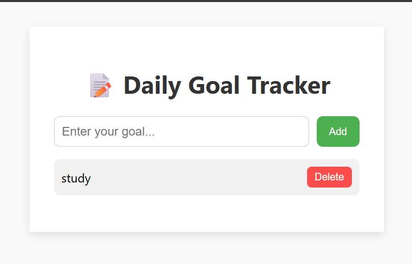

# Project 01: Daily Goal Tracker

A simple and clean daily goal/task tracker built using HTML, CSS, and JavaScript.

## 🌟 Features
- Add daily goals
- Mark goals as completed
- Delete goals
- Save progress in localStorage

## 📸 Preview

## 🚀 How to Run
1. Clone the repo or download the folder
2. Open `index.html` in your browser
3. Start tracking your goals!

## 🎯 Challenge
- Add a "Clear All" button
- Show current date
- Limit total goals to 5 per day

