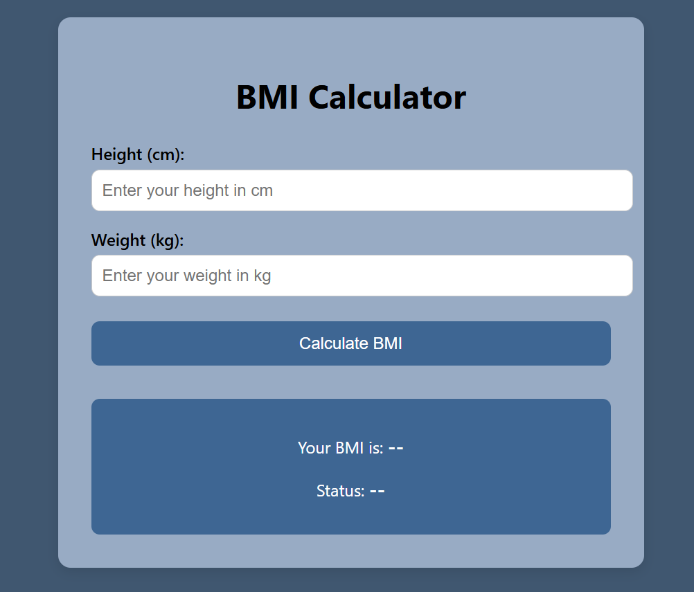

# Project 03: BMI Calculator

A simple and interactive Body Mass Index (BMI) calculator built using HTML, CSS, and JavaScript.

## 🌟 Features
- Enter height and weight
- Calculate BMI instantly
- Display BMI value with health category
- Responsive and beginner-friendly design

## 📸 Preview

## 🚀 How to Run
1. Clone the repo or download the folder  
2. Open `index.html` in your browser  
3. Enter your height and weight to see your BMI!

## 🎯 Challenge
- Add metric/imperial unit toggle (cm/kg ↔ ft/lb)  
- Show color-coded feedback (e.g. green = normal, red = obese)  
- Add BMI range chart for better understanding
