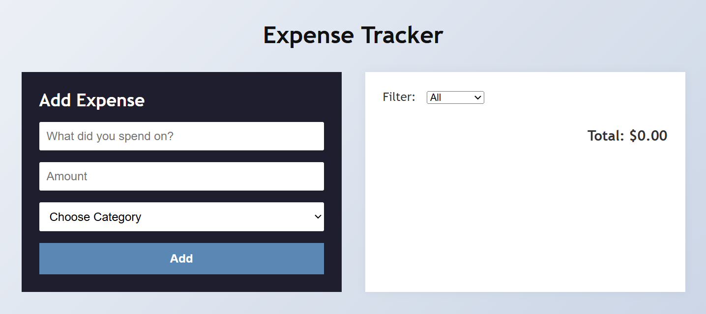

# Project 04: Expense Tracker with Category Filters

A modern expense tracker app built with HTML, CSS, and JavaScript that lets users log expenses, filter by category, and view totals dynamically.

## 🌟 Features
- Add expenses with description, amount, and category
- View a list of all expenses
- Filter expenses by category (e.g. Food, Travel, Shopping)
- View total expense amount
- Data persists using localStorage

## 📸 Preview

## 🚀 How to Run
1. Clone the repo or download the folder  
2. Open `index.html` in your browser  
3. Start tracking your spending in style!

## 🎯 Challenge
- Add a date picker and show expenses by date  
- Add monthly total and bar chart  
- Allow deleting/editing an individual expense  
- Export expenses to a CSV file
