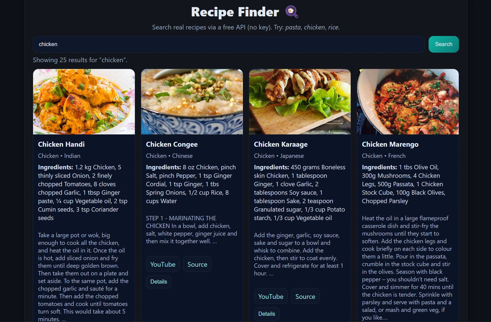

# Recipe Finder 🍳  
*A beginner-friendly HTML, CSS & JavaScript project from the Codeboid Real-Life Web Projects series.*


[](YOUR_CODEPEN_LINK)
[](LICENSE)




---

## 📌 About
Build a **JavaScript recipe finder** that searches real recipes from a free API (no key needed) and shows images, ingredients, and short instructions. Perfect for beginners practicing **fetch**, **DOM rendering**, and **friendly UX states** (loading/empty/error).

- Search with a debounced input (fast, no spam)
- See recipe image, category/area, top ingredients, short instructions
- Open **YouTube** / **Source** links when available
- Saves last search in `localStorage`
- Accessible status line (`aria-live`) for feedback

---

## 🔗 Live & Tutorial
- Demo (CodePen): **[LINK](https://codepen.io/Codeboid/pen/YPyermv)**
- Full tutorial (Codeboid): **[URL](https://codeboid.com/html-css-javascript-project-recipe-finder/)**
- Repo: this project

---

## 🗂 Project Structure
```

.
├── index.html
├── style.css
└── script.js

```

---

## 🛠 How to Run
1) Download or clone this repo  
2) Open `index.html` in your browser — that’s it 🚀

> No build tools or API keys required. Uses **TheMealDB** public search endpoint.

---

## 🤝 API (credit)
This project uses **TheMealDB**:  
`https://www.themealdb.com/api/json/v1/1/search.php?s=<query>`

- No API key required for basic search  
- Example: `...?s=pasta`

Please credit TheMealDB if you publish a derivative tutorial/app.

---

## 🧠 What You’ll Practice
- `fetch()` + JSON parsing  
- Debounce + `AbortController` (cancel in-flight requests)  
- Rendering lists with template strings  
- Small accessibility touches (`aria-live`, meaningful `alt`)  
- Defensive coding (`escapeHTML`, null checks)

---

## 🎯 Features
- Debounced search input (snappy UX)
- Responsive card grid with images
- Ingredient list (first few items)
- Short instruction preview
- External links (YouTube/Source) when present
- Saved last search via `localStorage`
- Friendly **loading**, **empty**, and **error** messages

---

## 🔧 Customization Tips
- **Theme colors:** edit `:root` CSS variables in `style.css`  
- **Results per card:** adjust how many ingredients/instruction lines you show  
- **Default search term:** change `"pasta"` inside `script.js` on load  
- **Card size:** tweak `minmax(240px, 1fr)` in the grid

---

## 🧪 Troubleshooting
- **Nothing shows up?** Check DevTools → Network. If requests to `themealdb.com` are blocked, try another network.  
- **No results for a term?** Try simpler queries like *chicken*, *rice*, *beef*.  
- **Broken images on some cards?** Some API entries lack images; try another result.  
- **Typing feels laggy?** Reduce debounce delay from `400`ms in `script.js`.

---

## 🛡️ Privacy Note
Searches are sent to `themealdb.com`. No auth is used; no personal data is collected by this demo.

---

## 📖 License
Licensed under the [MIT License](LICENSE).

---

## 🙌 Credits
- Data: [TheMealDB](https://www.themealdb.com/)  
- Tutorial & design: [Codeboid](https://codeboid.com/)


