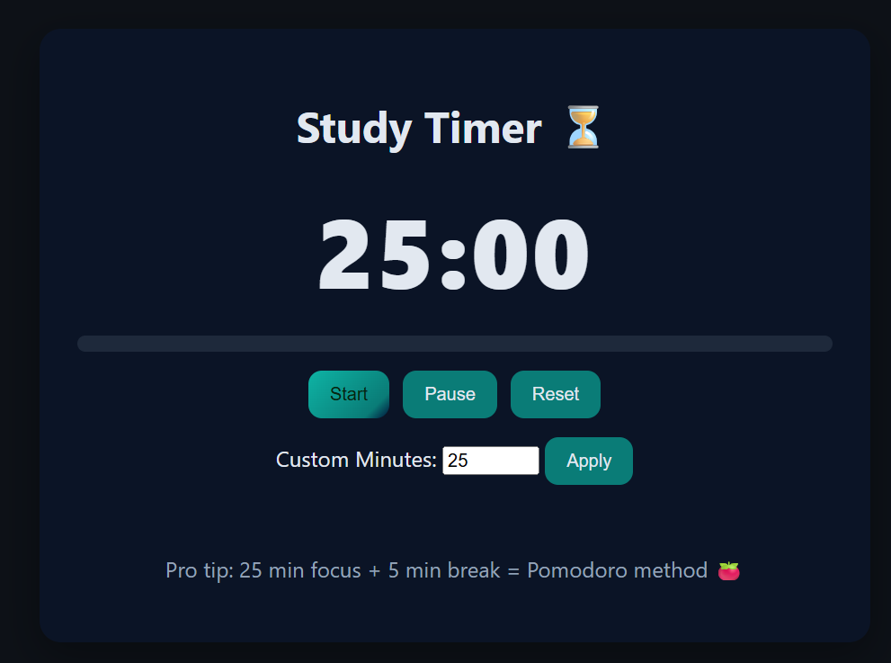

# Study Timer ⏱  
*A beginner-friendly HTML, CSS & JavaScript project from the Codeboid Real-Life Web Projects series.*


[](https://codepen.io/Codeboid/pen/jEbYjVr)
[](LICENSE)



---

## 📌 About
This project is a simple **Pomodoro-style study timer** built with **HTML, CSS, and JavaScript**. It helps you focus by letting you:

- Start a 25-minute study session  
- Pause and reset the timer  
- Set a **custom number of minutes** (1–180)  
- Hear a short **ding** when time’s up  

Perfect for beginners who want to practice **DOM manipulation, event listeners, and JavaScript intervals**.

---

## 🗂 Project Structure

```

.
├── index.html
├── style.css
└──script.js

````

---

## 🛠 How to Run

1) Download or clone the repo  
2) Open `index.html` in your browser — that’s it 🚀

> No build tools or frameworks required.

---

## 📖 Full Tutorial

Follow the step-by-step guide on Codeboid:  
👉 **[Build a Study Timer with HTML, CSS & JavaScript](https://codeboid.com/html-css-javascript-project-study-timer)**

Or try the live preview on CodePen:  
👉 **[Live Demo](https://codepen.io/Codeboid/pen/jEbYjVr)**

---

## 🎯 Features

- Clean dark theme with CSS variables  
- Start / Pause / Reset buttons  
- Custom minutes input (1–180)  
- Plays a sound when finished  
- Progress bar that fills as time passes

---

## 🔧 Tips & Customization

- **Change default minutes:** edit `script.js` and set  
  ```js
  let total = 25 * 60; // change 25 to your default
    ````

* **Brand colors:** tweak CSS variables in `style.css` (`--teal-start`, `--teal-end`, `--bg`, etc.)
* **Autoplay note:** some browsers require one user interaction before audio can play.

---


## 🤝 Contributing

PRs and suggestions are welcome! If you find a bug, open an issue.

---

## 📜 License

Licensed under the [MIT License](LICENSE).

